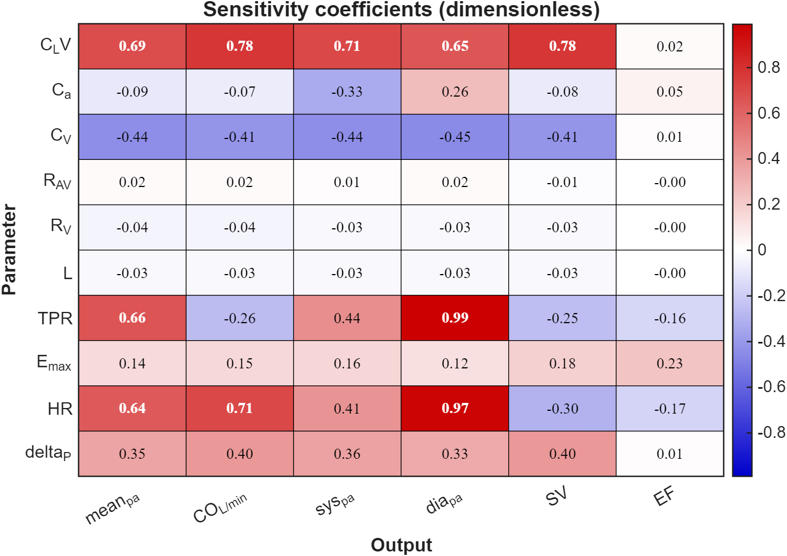
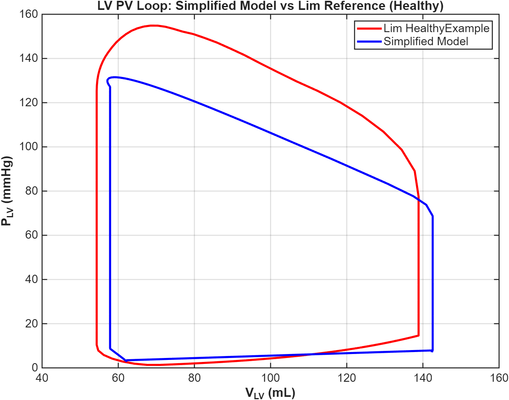
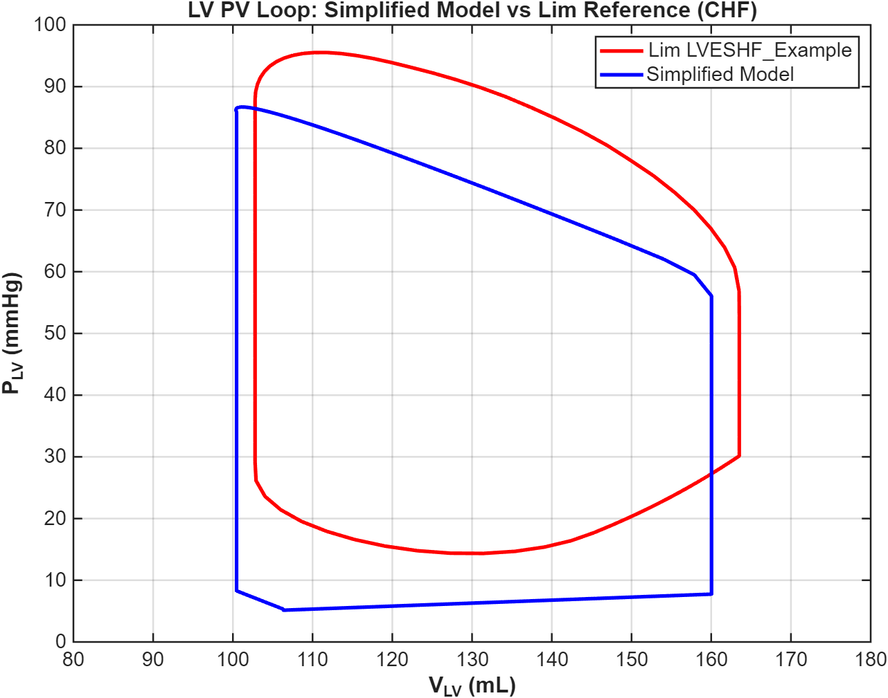

# Cardiovascular Digital Twin For LVAD Fault Analysis

**James Vu** · Engineering Honours Thesis, UNSW Canberra, 2026
Supervisor: Dr Michael Stevens

Supplementary material for the thesis poster. This page holds the figures and detail that didn't fit on the A1 sheet, plus the MATLAB/Simulink code that produced them.

Full repository of model and code is found via: https://github.com/unsw-edu-au/NumericalModel. However, users will need UNSW permission to access the repo.

**Contents:** [Overview](#overview) · [Model](#model) · [Sensitivity analysis](#sensitivity-analysis) · [Healthy calibration](#healthy-baseline-calibration) · [Heart failure calibration](#congestive-heart-failure-calibration) · [Digital shadow](#from-model-to-digital-shadow) · [Repository](#repository) · [References](#references)

---

## Overview

Left ventricular assist devices (LVADs) are an established therapy for end-stage heart failure, but they carry device-specific faults such as pump thrombosis, suction events and startup problems. Catching these early is important but we often don't know they exist until the patient comes back into the clinic. Validated models of the cardiovascular–LVAD system already exist, notably Lim et al.'s ten-compartment model [1], but they are built for offline simulation and are too expensive for continuous updating. This project builds a reduced-order lumped-parameter model of the cardiovascular system, couples it to a HeartMate 3 (HM3) pump model, and wraps it in a *digital shadow*: a model that receives real time data from a patient to reflect their current state.

The overarching research question is whether an existing LVAD–cardiovascular model can be adapted into a digital twin to support remote clinical fault analysis. It breaks into four sub-questions:

1. What is the minimum physiological complexity a cardiovascular model needs to represent clinically relevant haemodynamic states?
2. Can bedside signals drive a digital shadow that estimates cardiac output with less than 10% error?
3. Can the electromechanical behaviour of the HeartMate 3 be modelled within the digital shadow to at least 90% accuracy?
4. Can the full digital twin discriminate between device faults to at least 90% accuracy?

## Model

The model is Wu *et al.*'s simplified lumped-parameter circuit [2], which reduces an eleven-compartment circulation to a third-order system while keeping the subsystems that matter for LVAD behaviour.

The three states are left ventricular, arterial and venous volume. Kirchhoff's current law at each node gives

$$\frac{dV_{LV}}{dt} = Q_{V,in} - Q_{AV} - Q_{LVAD}, \qquad \frac{dV_a}{dt} = Q_{AV} + Q_{LVAD} - Q_{TPR}, \qquad \frac{dV_V}{dt} = Q_{TPR} - Q_{V,in}$$

Contraction is driven by a normalised parabolic elastance during systole,

$$E_n(t) = 1 - \left(\frac{2\,t_{mod}}{t_s} - 1\right)^2, \qquad C_{LV,sys}(t) = \frac{1}{E_{max}\,E_n(t)}$$

where $t_s$ is one third of the cardiac period and $E_{max}$ is peak elastance (contractility). In diastole the ventricle reverts to its fixed compliance $C_{LV}$.

<details>
<summary><b>Literature reference values (Wu et al.)</b></summary>

| Element | Symbol | Value | Units |
|---|---|---|---|
| LV diastolic compliance | $C_{LV}$ | 10.0 | mL/mmHg |
| Arterial compliance | $C_a$ | 1.83 | mL/mmHg |
| Venous compliance | $C_V$ | 70.0 | mL/mmHg |
| Aortic valve resistance | $R_{AV}$ | 0.002 | mmHg·s/mL |
| Venous resistance | $R_V$ | 0.004 | mmHg·s/mL |
| Blood inertance | $L$ | 0.010 | mmHg·s²/mL |
| Pulmonary back-pressure | $\delta_P$ | 5.0 | mmHg |

Cardiac parameters from Lim *et al.* [1]: $TPR$ = 0.74 mmHg·s/mL, $E_{max}$ = 3.54 mmHg/mL, HR = 60 bpm.

</details>

## Sensitivity analysis

A local one-at-a-time sensitivity analysis, following Lim *et al.*'s method, decided which parameters to identify and which to fix. The dimensionless coefficient for parameter $\theta_j$ and output $Y$ was computed by central difference with a 5% perturbation:

$$S_j = \frac{\partial Y / Y_0}{\partial \theta_j / \theta_j} \approx \frac{Y_{up} - Y_{down}}{2\,p\,Y_0}$$

Ten parameters were tested against six outputs spanning perfusion (mean aortic pressure, CO), pressure waveform (systolic and diastolic $P_a$) and cardiac mechanics (SV, EF). Parameters with $|S_j| < 0.1$ were fixed at literature values; the rest became candidates for tuning.


*Fig. 1 — Dimensionless sensitivity coefficients $S_j$ at the healthy baseline. Red indicates positive sensitivity (parameter ↑ → output ↑); blue indicates negative.*

At the healthy baseline $C_{LV}$, $TPR$ and HR dominate, while $E_{max}$ is only moderately influential. Six parameters cleared the threshold: $C_{LV}$, $TPR$, $E_{max}$, $C_V$, $C_a$ and $\delta_P$. HR was treated as a measured input rather than a tuning parameter, since it is continuously available at the bedside, and $L$, $R_V$ and $R_{AV}$ were fixed.

Repeating the analysis at a heart failure operating point ($E_{max}$ at 30% of its calibrated healthy value) revealed a sensitivity inversion:

| Parameter | Healthy max $\lvert S_j \rvert$ | CHF max $\lvert S_j \rvert$ |
|---|---|---|
| $L$ | 0.04 | 0.01 |
| $R_V$ | 0.04 | 0.00 |
| $R_{AV}$ | 0.09 | 0.02 |
| $C_a$ | 0.33 | 0.36 |
| $\delta_P$ | 0.40 | 0.23 |
| $C_V$ | 0.45 | 0.45 |
| $C_{LV}$ | 0.80 | 0.64 |
| HR | 0.97 | 0.70 |
| $TPR$ | 0.99 | 0.70 |
| $E_{max}$ | **0.26** | **0.76** |

$E_{max}$ goes from moderately to most influential. A healthy ventricle ejects with margin to spare, so small changes in contractility barely register; a failing ventricle sits near the threshold where ejection barely occurs, and the same change moves cardiac output and pressure substantially. This is what later makes $E_{max}$ the parameter that tracks deterioration in the digital shadow.

## Healthy baseline calibration

The six parameters were fitted to Lim *et al.*'s healthy outputs by Nelder-Mead simplex (`fminsearch`), minimising a weighted normalised least-squares objective

$$F(\theta) = \sum_i w_i \left(\frac{y_{model,i}(\theta) - y_{target,i}}{y_{target,i}}\right)^2$$

with $w_i = 1$ for perfusion and pressure targets and $w_i = 0.5$ for SV and EF, which serve as verification checks. Nelder-Mead was chosen for consistency with Lim *et al.* and because it needs no gradients; the diode valves make the objective non-smooth. The objective fell from 0.350 to 0.0026 in 17 iterations.

| Output | Model | Lim target | Error |
|---|---|---|---|
| Mean $P_a$ (mmHg) | 98.6 | 95.0 | +3.7% |
| CO (L/min) | 5.07 | 5.10 | −0.7% |
| Systolic $P_a$ (mmHg) | 131.1 | 135.0 | −2.9% |
| Diastolic $P_a$ (mmHg) | 68.7 | 70.0 | −1.9% |
| SV (mL) | 85.4 | 85.0 | +0.5% |
| EF (%) | 59.9 | 60.0 | −0.1% |

All six outputs land within 5% of the reference.


*Fig. 2 — LV PV loops at the healthy baseline. Red: Lim et al. Blue: calibrated simplified model.*

Loop geometry agrees closely. The flattened systolic peak (about 15% lower) is structural: Wu's parabolic elastance cannot reproduce the sharp end-systolic stiffening of Lim's curvilinear ESPVR.

<details>
<summary><b>Calibrated parameters and drift from literature values</b></summary>

| Parameter | Literature | Calibrated | Drift |
|---|---|---|---|
| $C_{LV}$ (mL/mmHg) | 10.00 | 18.04 | +80% |
| $TPR$ (mmHg·s/mL) | 0.74 | 1.108 | +50% |
| $E_{max}$ (mmHg/mL) | 3.54 | 2.28 | −36% |
| $C_V$ (mL/mmHg) | 70.00 | 39.78 | −43% |
| $C_a$ (mL/mmHg) | 1.83 | 1.17 | −36% |
| $\delta_P$ (mmHg) | 5.00 | 2.76 | −45% |

The large drifts are structural compensation rather than physiology: the three-state model has to absorb right-heart, pulmonary and distributed peripheral effects that Lim's model represents explicitly.

</details>

## Congestive heart failure calibration

Heart failure was modelled as systolic dysfunction in the same patient, following Lim *et al.* Two approaches were compared to expose the trade-off between physiological interpretability and fit.

**Single parameter ($E_{max}$ only).** Every other parameter is inherited from the healthy calibration, reflecting that heart failure primarily impairs contractility.

| Output | Model | Lim target | Error |
|---|---|---|---|
| Mean $P_a$ (mmHg) | 70.7 | 67.0 | +5.5% |
| CO (L/min) | 3.53 | 3.60 | −1.8% |
| Systolic $P_a$ (mmHg) | 93.3 | 88.0 | +6.1% |
| Diastolic $P_a$ (mmHg) | 49.9 | 58.0 | −14.0% |
| SV (mL) | 59.0 | 60.0 | −1.6% |
| EF (%) | 39.2 | 37.0 | +5.9% |

$E_{max}$ settled at 44.6% of its healthy value rather than Lim's 30%. In Lim's model contractility shares the load with a curvilinear ESPVR, septal and pericardial interaction and explicit right-heart dynamics; in the simplified model $E_{max}$ carries the entire contractile burden, so a smaller reduction reproduces the same outputs. The diastolic error persisted through intermediate two- and three-parameter runs, pointing to a structural origin.

**Six parameters.** The same optimisation as the healthy case brings every output within 6% and cuts the objective six-fold ($F$ = 0.0048).

| Output | Model | Lim target | Error |
|---|---|---|---|
| Mean $P_a$ (mmHg) | 70.8 | 67.0 | +5.7% |
| CO (L/min) | 3.57 | 3.60 | −0.9% |
| Systolic $P_a$ (mmHg) | 86.4 | 88.0 | −1.8% |
| Diastolic $P_a$ (mmHg) | 56.1 | 58.0 | −3.3% |
| SV (mL) | 59.7 | 60.0 | −0.6% |
| EF (%) | 37.3 | 37.0 | +0.7% |


*Fig. 3 — LV PV loops in CHF, six-parameter calibration against Lim et al.*

The better fit comes at a cost that is visible in the parameter drift from the healthy state. The fall in $E_{max}$ (−62%) and modest rise in $C_{LV}$ (+15%) match the contractile loss and dilation of heart failure, and $TPR$ and $C_V$ barely move. But arterial compliance rises 47%, when it is a wall property that should not change in the same patient, and pulmonary back-pressure falls 38%, when pulmonary congestion would push it up. Those two drifts are the optimiser compensating for model structure. The six-parameter calibration was adopted for consistency with the digital shadow, with this identifiability problem carried forward as the central issue the shadow had to address.

## From model to digital shadow

The calibrated model became the core of the digital shadow presented on the poster, which re-identifies the six parameters at each update from bedside signals and predicts cardiac output. Two changes since the interim stage included integrating the pump into the shadow to gain an extra signal in LVAD flow, and the inclusion of the central venous pressure as an additional signal to make it 5 total optimiser targets.

## Repository

```
vu_james_2026/
├── CVS/            Simulink model (Simplified_CVS.slx) — must stay in this folder
├── Shadow/         Digital shadow: config, forward sim, update, experiment runners
│   └── Data/       Committed .mat results used by the plotting scripts
├── figures/        Figures on this page
├── startup.m       Adds project paths
└── README.md
```

Requires MATLAB R2025b with Simulink. The shadow pipeline is `shadow_config` → `shadow_forward_simulink` → `shadow_update`, driven by the experiment runners (`run_lvad_ramp_withCVP`, `run_lvad_updown_withCVP`). Plotting scripts run self-contained against the `.mat` files in `Shadow/Data/`. Regenerating the input scenarios needs shared lab resources that are not included here.

## References

1. E. Lim *et al.*, "Parameter-optimized model of cardiovascular–rotary blood pump interactions," *IEEE Trans. Biomed. Eng.*, vol. 57, no. 2, pp. 254–266, 2010.
2. Y. Wu, P. E. Allaire, G. Tao, and D. Olsen, "Modeling, estimation, and control of human circulatory system with a left ventricular assist device," *IEEE Trans. Control Syst. Technol.*, vol. 15, no. 4, pp. 754–767, 2007. doi:10.1109/TCST.2006.890303
3. L. Boss, "Advancing the assessment and encouragement of myocardial recovery in LVAD patients," PhD thesis, UNSW Sydney, 2025.
4. D. A. Kass *et al.*, "Influence of contractile state on curvilinearity of in situ end-systolic pressure–volume relations," *Circulation*, vol. 79, pp. 167–178, 1989.
5. M. P. Mulder *et al.*, "Computational physiological models for hemodynamic management in critical care: A systematic literature review focusing on model design, credibility and clinical readiness," *Comput. Biol. Med.*, vol. 205, 111561, 2026.

## Acknowledgements

Thanks to Laurence Boss of the UNSW research team for providing his PhD thesis for the pump model integration. Claude (Anthropic) was used to assist with MATLAB plotting scripts and code readability.

## Contact

z5470823@ad.unsw.edu.au
